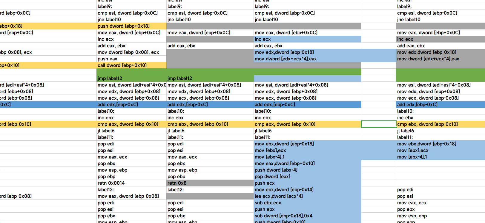

# EasyFish

公司这个月开展了内部钓鱼演练，由于GoPhish底层用的魔改后的GoMail，在smtp发信上存在一定问题，故抛弃

重构编写了 EasyFish 这款钓鱼工具，大小不到5MB，非常轻，批量发件、自定义邮件头、钓鱼网站、后续追踪、表单追踪、鱼站重定向等功能全部涵盖

正值HVV期间，并且刚结束公司的钓鱼演练，所以晚个把月上传工具，防止被红队喷挂马并且影响到公司，这期间再优化优化，比如移除socket，实现在Ring3直接和Ring0的afd通信。

========使用意义========

1、替代GoPhish所有功能，GoPhish有的它都有，GoPhish没有的它也有。

2、快速实现规模化的钓鱼演练，并输出成工作成果

3、HVV | 指定目标钓鱼

=======03.21更新=======

HW在即，争取这个月成品放出来，算法汇编在手撸，真的在尽力了，并没有躺平不干事。因为要从0到1实现一个轻量级关系型数据库，底层效率必须弄好。

目前就是在搞数据库的底层算法，搞完算法写CRUD逻辑，写完就是完整的新型数据库了，纯 winapi+CRT ，dll封装出来体积不会超过10kb。

然后数据库搞完，就是应用到半成品的 EasyFish 上，之后处理下UI，就完成了。

UI使用了三方库，预计软件总体积小于1.5mb，upx压缩后估计小于900kb，去掉UI库最多100kb，压缩后小于60kb，不过没必要，UI好看点也重要。

EasyFish 开箱即用，开销极低，美丽版1mb+，丑陋版100kb都不到，使用期间不需要安装间件和任何脚本语言。

